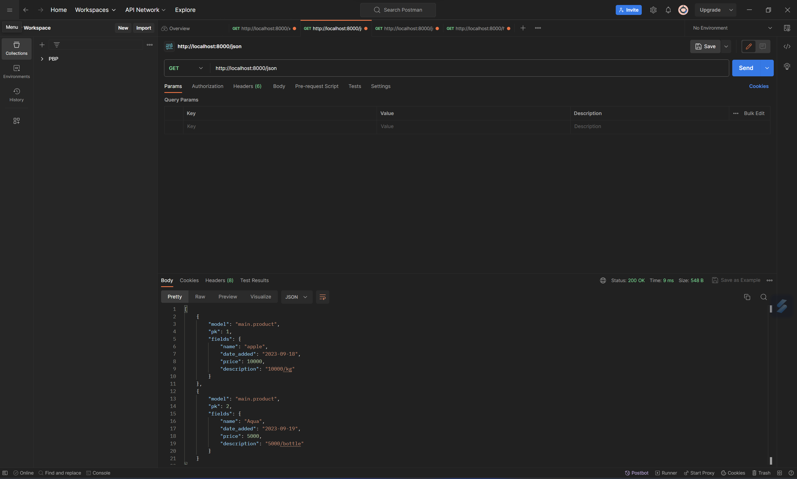
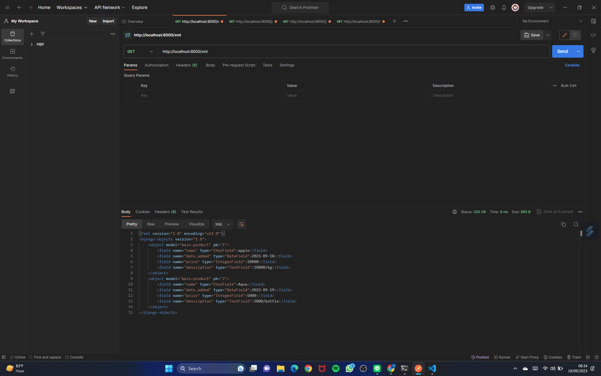
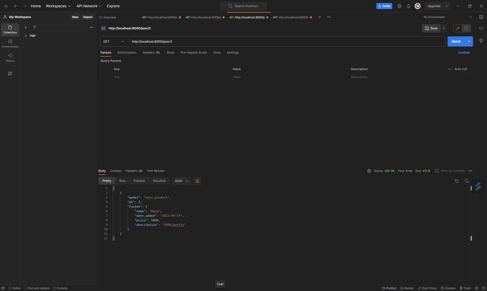
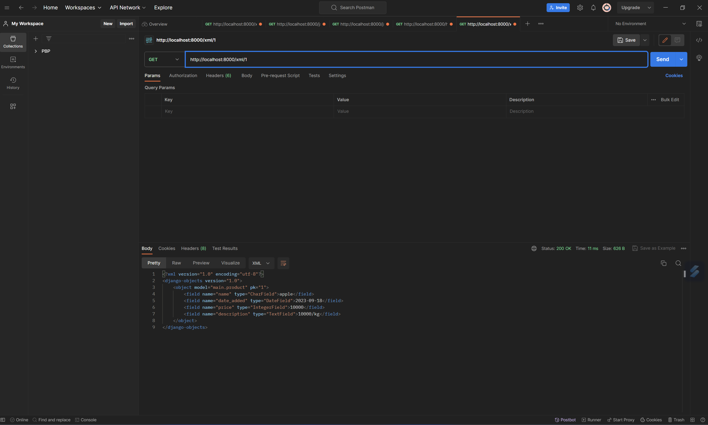
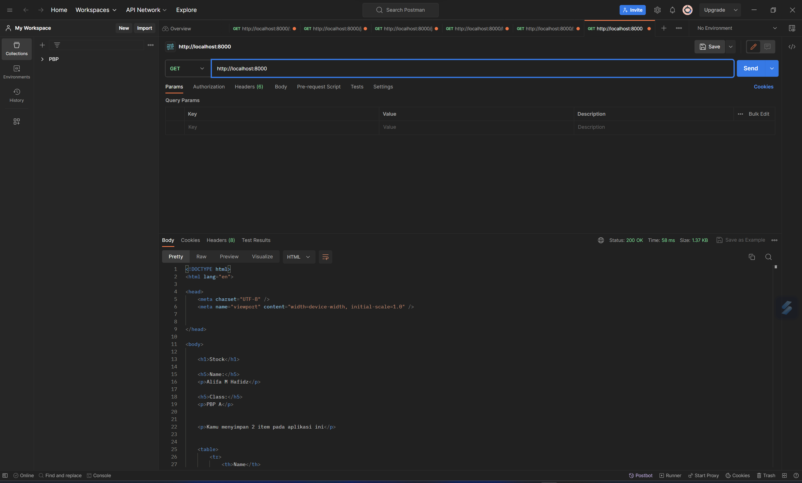

Membuat Proyek Django Baru:

Buka terminal dan jalankan perintah django-admin startproject nama_proyek untuk membuat proyek Django baru.
Membuat Aplikasi 'main':

Di dalam direktori proyek Django, jalankan perintah python manage.py startapp main untuk membuat aplikasi dengan nama 'main'.
Melakukan Routing pada Proyek:

Buka file urls.py di dalam proyek Django dan tambahkan path untuk mengarahkan ke aplikasi 'main'. Contoh: path('main/', include('main.urls')).
Membuat Model 'Item':

Buka file models.py di dalam aplikasi 'main' dan buat model 'Item' dengan atribut yang sesuai, seperti yang telah dijelaskan dalam checklist.
Membuat Fungsi pada views.py:

Buka file views.py di dalam aplikasi 'main' dan buat sebuah fungsi yang akan merender template HTML dengan informasi yang diminta.
Membuat Routing pada urls.py Aplikasi 'main':

Buka file urls.py di dalam aplikasi 'main' dan buat path untuk memetakan fungsi yang telah dibuat di views.py.
Deployment ke Adaptable

  +----------+         +----------------+       +-------------+
  | Client   |   --->  | urls.py (routing)| --->  | views.py    |
  | (Browser)|  Request|------------------|       | (Controller)|
  |          |         |    (URL Path)   |       |             |
  |          |         +----------------+       +-------------+
  |          |               |                        |
  |          |         +-----v------+                 |
  |          |         | models.py |                 |
  |          |   <---  | (Model)   |  <--------------+
  |          |   Response|-----------|
  +----------+          |   (Database)|
                        +------------+

urls.py digunakan untuk routing permintaan dari client ke views yang sesuai.
views.py berisi logika aplikasi, seperti memproses permintaan dan merender template HTML.
models.py adalah tempat di mana kita mendefinisikan model database yang digunakan oleh aplikasi. Model ini dapat diakses oleh views untuk mengambil atau menyimpan data.


Meskipun sangat disarankan untuk memakai virtual environment, kita masih dapat membuat aplikasi web berbasis Django tanpa menggunakan virtual environment. Namun, ini dapat menyebabkan masalah seperti konflik dependensi dan kesulitan dalam mengelola berbagai proyek. Oleh karena itu, sangat disarankan untuk menggunakan virtual environment untuk pengembangan aplikasi Python, terutama jika Anda bekerja pada proyek-proyek yang lebih besar atau memiliki dependensi yang kompleks. Virtual environment adalah alat yang kuat untuk menjaga lingkungan pengembangan agar tetap bersih, terisolasi, dan teratur.

MVC (Model-View-Controller):
Model: Mewakili data dan logika bisnis. Ini adalah komponen yang mengurus pengelolaan data dan berinteraksi dengan basis data.
View: Menampilkan data kepada pengguna. Tidak memiliki logika bisnis. Hanya menangani presentasi.
Controller: Menangani permintaan dari pengguna, memproses input, dan mengatur alur aplikasi. Ini adalah otak dari aplikasi yang menghubungkan Model dan View.

MVT (Model-View-Template):
Model: Mirip dengan MVC, mewakili data dan logika bisnis. Ini berinteraksi dengan basis data.
View: Menentukan bagaimana data ditampilkan kepada pengguna. Tidak memiliki logika bisnis. Mengambil data dari Model.
Template: Mengatur tampilan dan struktur halaman HTML. Ini adalah bagian yang merender data yang diberikan oleh View.

MVVM (Model-View-ViewModel):
Model: Mewakili data dan logika bisnis, sama seperti dalam MVC dan MVT.
View: Menampilkan data seperti dalam MVC dan MVT. Tidak memiliki logika bisnis.
ViewModel: Memisahkan logika tampilan dari tampilan itu sendiri. Ini adalah lapisan yang mengelola data yang akan ditampilkan dan berfungsi sebagai penghubung antara Model dan View. ViewModel mempersiapkan data yang akan ditampilkan oleh View.

Perbedaan utama antara ketiganya adalah bagaimana logika aplikasi dan tampilan dipisahkan dan bagaimana data mengalir antara komponen-komponen tersebut. MVC memiliki Controller, MVT menggunakan Template, sedangkan MVVM memiliki ViewModel. Django, sebuah kerangka kerja berbasis MVT, memisahkan tampilan dengan Template, sementara Model dan View bekerja lebih dekat bersama.

TUGAS 3

Dalam konteks Django, terdapat perbedaan antara form POST dan form GET. Berikut adalah perbedaan antara keduanya:
Form POST:
-Nilai variabel tidak ditampilkan di URL, sehingga user tidak dapat dengan mudah memasukkan nilai baru
-Lebih aman daripada form GET
-Tidak dibatasi panjang string
-Pengambilan variabel menggunakan request.POST.get

Form GET:
-Nilai variabel ditampilkan di URL, sehingga user dapat dengan mudah memasukkan nilai baru
-Kurang aman daripada form POST
-Dibatasi panjang string sampai 2047 karakter
-Pengambilan variabel menggunakan request.GET.get


XML, JSON, dan HTML adalah tiga format yang berbeda dalam konteks pengiriman data. Berikut adalah perbedaan utama antara ketiganya:
XML (Extensible Markup Language):
-Digunakan untuk merepresentasikan data dengan cara yang dapat dibaca mesin
-Digunakan untuk menyimpan dan mengangkut data dari satu aplikasi ke aplikasi lain melalui Internet
-Lebih kompleks dan lebih lambat daripada JSON
-Memiliki aturan yang ketat dalam penulisan tanda
-File XML diakhiri dengan ekstensi .xml

JSON (JavaScript Object Notation):
-Digunakan untuk menyimpan dan mengirimkan data dengan cara data diuraikan dan dikirimkan melalui internet
-Format pertukaran data terbuka yang dapat dibaca baik oleh manusia maupun mesin
-Bersifat independen dari setiap bahasa pemrograman dan merupakan output API umum dalam berbagai aplikasi
-Lebih ringan dan berukuran lebih kecil daripada XML
-Dapat menyimpan data dalam bentuk array dan menjadikan transfer data menjadi lebih mudah
-File JSON diakhiri dengan ekstensi .json

HTML (Hypertext Markup Language):
-Digunakan untuk membuat halaman web
-Lebih terbatas dalam hal struktur dan tidak dapat merepresentasikan data dengan cara yang dapat dibaca mesin
-Memiliki tanda standar yang harus digunakan semua orang
-Tidak dapat membuat tanda kustom

Dalam konteks pengiriman data, JSON lebih sering digunakan daripada XML karena lebih ringan, lebih cepat, dan lebih mudah dipahami oleh komputer
HTML, di sisi lain, digunakan untuk membuat halaman web dan tidak digunakan untuk pengiriman data antar aplikasi


JSON sering digunakan dalam pertukaran data antara aplikasi web modern karena beberapa alasan, di antaranya:
-Ringan dan responsif: JSON memiliki sintaks yang kecil dan ringan, sehingga lebih responsif terhadap request
Selain itu, JSON juga lebih ringan dan berukuran lebih kecil daripada format pertukaran data lainnya seperti XML
-Mudah dibaca dan dimengerti: JSON mudah dibaca dan ditulis oleh manusia, sehingga lebih mudah dimengerti oleh pengembang
Selain itu, JSON juga mudah dimengerti oleh mesin
-Mendukung array: JSON dapat menyimpan data dalam bentuk array, sehingga transfer data menjadi lebih mudah
-Mendukung API: JSON unggul dalam penanganan API baik untuk aplikasi berbasis web maupun mobile
-Mendukung banyak bahasa pemrograman: JSON bersifat independen dari setiap bahasa pemrograman dan merupakan output API umum dalam berbagai aplikasi

1.Mengatur Routing:
Buka berkas urls.py pada folder shopping_list dalam proyek Django.
Ubah pola URL dari main/ menjadi '' pada urlpatterns sehingga menjadi path('', include('main.urls')),.

2.Membuat Kerangka Tampilan (Views):
Buat folder templates pada root folder proyek.
Buat berkas HTML baru bernama base.html dalam folder templates dan isi dengan kode kerangka umum untuk halaman web. Ini akan menjadi template dasar untuk halaman web lainnya.

3.Menggunakan Template Dasar:
Ubah berkas main.html dalam folder templates/main (atau sesuai dengan struktur direktori) untuk meng-extend base.html.

4.Membuat Form Input Data:
Buat berkas forms.py dalam aplikasi main untuk mendefinisikan form input data barang.
Buat sebuah class ProductForm yang merupakan turunan dari ModelForm dan menentukan model yang akan digunakan serta field-field yang akan ditampilkan pada form.

5.Mengatur Fungsi Views:
Di berkas views.py aplikasi main, buat fungsi create_product untuk menangani pembuatan produk baru.
Di dalam fungsi ini, buat instance form ProductForm dari request POST, lakukan validasi form, dan simpan data produk jika form valid.

6.Menampilkan Data Produk pada HTML:
Di dalam fungsi show_main dalam views.py, ambil semua data produk dari model Product.
Kirim data tersebut ke template main.html untuk ditampilkan.

7.Mengatur URL Routing:
Di berkas urls.py aplikasi main, impor fungsi create_product yang telah dibuat sebelumnya.
Tambahkan path URL untuk mengakses fungsi tersebut.

8.Mengakses Data dalam Bentuk XML:
Buka views.py yang ada pada folder main dan tambahkan import HttpResponse dan Serializer pada bagian paling atas.
Buatlah sebuah fungsi yang menerima parameter request dengan nama show_xml dan buatlah sebuah variabel di dalam fungsi tersebut yang menyimpan hasil query dari seluruh data yang ada pada Product.
Tambahkan return function berupa HttpResponse yang berisi parameter data hasil query yang sudah diserialisasi menjadi XML dan parameter content_type="application/xml".

9.Mengakses Data dalam Bentuk JSON:
Buka views.py yang ada pada folder main dan buatlah sebuah fungsi baru yang menerima parameter request dengan nama show_json.
Tambahkan return function berupa HttpResponse yang berisi parameter data hasil query yang sudah diserialisasi menjadi JSON dan parameter content_type="application/json".

10.Mengakses Data Berdasarkan ID dalam Bentuk XML dan JSON:
Buka views.py yang ada pada folder main dan buatlah sebuah fungsi baru yang menerima parameter request dan id dengan nama show_xml_by_id dan show_json_by_id.
Buatlah sebuah variabel di dalam fungsi tersebut yang menyimpan hasil query dari data dengan id tertentu yang ada pada Product.
Tambahkan return function berupa HttpResponse yang berisi parameter data hasil query yang sudah diserialisasi menjadi JSON atau XML dan parameter content_type dengan value "application/xml" (untuk format XML) atau "application/json" (untuk format JSON).

11.Mengatur URL Routing:
Buka urls.py yang ada pada folder main dan impor fungsi-fungsi yang sudah kamu buat tadi.
Tambahkan path URL ke dalam urlpatterns untuk mengakses fungsi-fungsi yang sudah diimpor tadi.
urlpatterns = [
    path('', show_main, name='show_main'),
    path('create-product', create_product, name='create_product'),
    path('xml/', show_xml, name='show_xml'),
    path('json/', show_json, name='show_json'),
    path('xml/<int:id>/', show_xml_by_id, name='show_xml_by_id'),
    path('json/<int:id>/', show_json_by_id, name='show_json_by_id'),
    # ... tambahkan path lain sesuai kebutuhan ...
]

12.Menjalankan Aplikasi:
Jalankan proyek Django dengan perintah python manage.py runserver.


 

 




Tugas 4

Django UserCreationForm
Django UserCreationForm adalah sebuah form bawaan Django yang digunakan untuk membuat user baru pada aplikasi web. Form ini sudah terintegrasi dengan fitur autentikasi bawaan Django, sehingga memudahkan developer dalam membuat fitur autentikasi pada aplikasi web. Kelebihan dari UserCreationForm adalah kemudahan dalam penggunaannya, karena form ini sudah terintegrasi dengan fitur autentikasi bawaan Django. Namun, kekurangannya adalah kurang fleksibel dalam hal tampilan dan validasi data.

Autentikasi dan Otorisasi dalam Django
Autentikasi adalah proses untuk memverifikasi identitas pengguna pada aplikasi web. Sedangkan otorisasi adalah proses untuk memberikan hak akses pada pengguna berdasarkan peran atau role yang dimilikinya. Keduanya sangat penting dalam pengembangan aplikasi web, karena dapat memastikan keamanan dan privasi data pengguna.

Cookies dalam Konteks Aplikasi Web
Cookies adalah file kecil yang disimpan pada browser pengguna saat mengakses sebuah situs web. Cookies digunakan untuk menyimpan informasi pengguna, seperti preferensi dan data sesi. Django menggunakan cookies untuk mengelola data sesi pengguna, seperti data autentikasi dan otorisasi. Data cookies dapat diakses oleh server saat pengguna mengakses situs web, sehingga memudahkan pengelolaan data sesi pengguna.

Keamanan Penggunaan Cookies dalam Pengembangan Web
Penggunaan cookies secara default dalam pengembangan web relatif aman, namun terdapat risiko potensial yang harus diwaspadai. Cookies dapat digunakan untuk melacak aktivitas pengguna pada situs web, sehingga dapat menimbulkan masalah privasi. Selain itu, cookies juga dapat disalahgunakan oleh pihak yang tidak bertanggung jawab untuk melakukan serangan pada situs web. Oleh karena itu, developer harus memastikan bahwa cookies yang digunakan pada situs web aman dan terenkripsi dengan baik.


- Buka views.py pada subdirektori main dan tambahkan impor berikut:

    from django.shortcuts import redirect
    from django.contrib.auth.forms import UserCreationForm
    from django.contrib import messages

- Buat fungsi register yang menerima parameter request dan tambahkan potongan kode berikut:

    def register(request):
        form = UserCreationForm()
        if request.method == "POST":
            form = UserCreationForm(request.POST)
            if form.is_valid():
                form.save()
                messages.success(request, 'Your account has been successfully created!')
                return redirect('main:login')
        context = {'form': form}
        return render(request, 'register.html', context)


- Buat berkas HTML baru dengan nama register.html

- Impor fungsi register di urls.py dan tambahkan path URL untuk mengaksesnya.

Membuat Fungsi Login

- Buka views.py dan tambahkan impor berikut:

    from django.contrib.auth import authenticate, login


- Buat fungsi login_user yang menerima parameter request dan tambahkan potongan kode berikut:

    def login_user(request):
        if request.method == 'POST':
            username = request.POST.get('username')
            password = request.POST.get('password')
            user = authenticate(request, username=username, password=password)
            if user is not None:
                login(request, user)
                return redirect('main:show_main')
            else:
                messages.info(request, 'Sorry, incorrect username or password. Please try again.')
        context = {}
        return render(request, 'login.html', context)

- Buat berkas HTML baru dengan nama login.html

- Impor fungsi login_user di urls.py dan tambahkan path URL untuk mengaksesnya.

Membuat Fungsi Logout

- Buka views.py dan tambahkan impor berikut:

    from django.contrib.auth import logout

- Buat fungsi logout_user yang menerima parameter request dan tambahkan potongan kode berikut:

    def logout_user(request):
        logout(request)
        return redirect('main:login')

- Impor fungsi logout_user di urls.py dan tambahkan path URL untuk mengaksesnya.

Merestriksi Akses Halaman Main

- Buka views.py dan tambahkan impor berikut:

    from django.contrib.auth.decorators import login_required

- Tambahkan decorator @login_required(login_url='/login') di atas fungsi show_main untuk merestriksi akses ke halaman utama.

Menggunakan Data Dari Cookies

- Buka views.py dan tambahkan impor berikut:

    import datetime
    from django.http import HttpResponseRedirect
    from django.urls import reverse

- Modifikasi fungsi login_user untuk menambahkan cookie last_login saat pengguna login.

- Modifikasi fungsi show_main untuk menampilkan data cookie last_login pada halaman utama.

- Modifikasi fungsi logout_user untuk menghapus cookie last_login saat pengguna logout.

- Tambahkan tampilan data cookie last_login di berkas main.html.

Menghubungkan Model Product dengan User

- Buka models.py dan tambahkan impor berikut:

    from django.contrib.auth.models import User

- Tambahkan field user dengan tipe ForeignKey pada model Product untuk menghubungkan setiap produk dengan pengguna yang membuatnya.

- Modifikasi fungsi create_product untuk mengisi field user dengan pengguna yang sedang login saat produk dibuat.

- Modifikasi fungsi show_main untuk hanya menampilkan produk yang terasosiasi dengan pengguna yang sedang login.

- Lakukan migrasi model dengan python manage.py makemigrations dan python manage.py migrate untuk mengaplikasikan perubahan model.

- Jalankan proyek Django dengan python manage.py runserver dan coba membuat akun baru, login, dan amati bahwa produk hanya ditampilkan sesuai dengan pengguna yang membuatnya.


Tugas 5
1. Jelaskan manfaat dari setiap element selector dan kapan waktu yang tepat untuk menggunakannya.

    Manfaat dari Setiap Element Selector dan Waktu yang Tepat untuk Menggunakannya:

    *Element Selector (element): Selector ini memilih semua elemen dengan tag yang sama. Contoh penggunaan yang tepat adalah ketika Anda ingin menerapkan gaya seragam ke semua elemen dengan tag tertentu.

    *Class Selector (.class): Selector ini memilih elemen berdasarkan nama kelas yang Anda tentukan. Ini berguna saat Anda ingin memberikan gaya yang sama kepada beberapa elemen yang berbeda tag, tetapi memiliki kelas yang sama.

    *ID Selector (#id): Selector ini memilih elemen dengan ID tertentu. Biasanya digunakan untuk menerapkan gaya atau logika khusus pada elemen tunggal.
    Universal Selector (*): Selector ini memilih semua elemen pada halaman. Namun, sebaiknya digunakan dengan hati-hati karena dapat mempengaruhi semua elemen.

2. Jelaskan HTML5 Tag yang kamu ketahui.

   Beberapa tag HTML5 :

   ```
    <header>    : Untuk bagian header halaman.
    <nav>       : Untuk menu navigasi.
    <article>   : Untuk konten artikel.
    <section>   : Untuk bagian atau sub-bagian dalam dokumen.
    <footer>    : Untuk bagian footer halaman.
    <video>     : Untuk menampilkan video.
    <audio>     : Untuk menampilkan audio.
    <canvas>    : Untuk menggambar grafis interaktif.
    ```

3. Jelaskan perbedaan antara margin dan padding.

    *Margin: Margin adalah ruang di sekitar elemen HTML yang berfungsi untuk memberikan jarak antara elemen ini dengan elemen-elemen lain di sekitarnya. Margin tidak memiliki latar belakang atau warna dan tidak akan memengaruhi tampilan elemen itu sendiri.

    *Padding: Padding adalah ruang di dalam elemen HTML, di antara konten elemen dan batas elemen tersebut. Padding memengaruhi tampilan elemen dan memberikan jarak antara konten elemen dan batasnya.

4. Jelaskan perbedaan antara framework CSS Tailwind dan Bootstrap. Kapan sebaiknya kita menggunakan Bootstrap daripada Tailwind, dan sebaliknya?

    *Tailwind CSS: Tailwind adalah framework CSS yang mempromosikan penggunaan kelas utility yang sangat deskriptif untuk mengatur tampilan. Ini memberikan kontrol yang tinggi tetapi memerlukan penulisan lebih banyak kode CSS langsung. Tailwind Lebih cocok ketika kita ingin memiliki kendali yang lebih besar atas tampilan dan ingin menghindari gaya desain bawaan. 

    *Bootstrap: Bootstrap adalah framework CSS yang menyediakan komponen siap pakai dan gaya desain yang konsisten. Ini memudahkan dalam pengembangan web yang cepat tetapi mungkin kurang fleksibel dibandingkan dengan Tailwind. Bootstrap Lebih cocok jika ketika kita ingin membangun proyek dengan cepat dan menginginkan komponen-komponen siap pakai yang telah dirancang dengan baik.


5.  Jelaskan bagaimana cara kamu mengimplementasikan checklist di atas secara step-by-step (bukan hanya sekadar mengikuti tutorial).


    *Atur warna latar belakang dengan menggunakan properti CSS background-color.

    *Sesuaikan margin, padding, dan jarak antara elemen-elemen form dengan menggunakan properti CSS seperti margin dan padding.

    *Ganti jenis font atau ukuran teks dengan menggunakan properti CSS font-family dan font-size.

    *Ubah gaya tombol dengan menggunakan properti CSS seperti background-color, color, dan border.

    *Format elemen-elemen input form dengan menggunakan properti CSS seperti border, border-radius, dan box-shadow.


Tugas 6

1. Asynchronous programming adalah paradigma pemrograman di mana eksekusi suatu program tidak diblokir saat menunggu operasi yang berjalan lama selesai. Sebaliknya, program terus dijalankan, dan hasil operasi ditangani nanti ketika sudah tersedia. Sebaliknya, synchronous programming adalah paradigma pemrograman di mana eksekusi program diblokir sambil menunggu operasi yang berjalan lama selesai.

2. Paradigma event-driven programming adalah paradigma pemrograman yang berfokus pada kejadian atau event yang terjadi pada program. Pada paradigma ini, program akan menunggu kejadian terjadi dan menangani kejadian tersebut ketika terjadi. Contoh penerapannya pada tugas ini adalah ketika pengguna melakukan klik pada tombol "add" pada halaman web, maka program akan menangani kejadian tersebut dan mengirimkan data ke server menggunakan AJAX.

3. Penerapan asynchronous programming pada AJAX memungkinkan program untuk melakukan request ke server tanpa harus menunggu respon dari server. Dalam hal ini, program akan melanjutkan eksekusi kode setelah melakukan request, dan akan menangani respon dari server ketika respon tersebut diterima.

4. Fetch API dan jQuery adalah dua teknologi yang dapat digunakan untuk melakukan AJAX request pada JavaScript. Fetch API adalah teknologi bawaan JavaScript yang lebih modern dan fleksibel dibandingkan dengan jQuery. Fetch API menggunakan promise-based API, sehingga lebih mudah digunakan dan lebih mudah dipahami Selain itu, Fetch API juga mendukung fitur-fitur seperti caching data dan membaca streaming response Meskipun demikian, jQuery masih digunakan oleh beberapa developer karena kelebihannya dalam mendukung browser yang lebih lama Namun, secara keseluruhan, Fetch API lebih disarankan untuk digunakan karena lebih modern dan fleksibel.

5. 
- Buat Fungsi add_product_ajax di views.py:
Buka berkas views.py dan tambahkan fungsi add_product_ajax.
Impor csrf_exempt decorator dari django.views.decorators.csrf.
Dekorasikan fungsi dengan @csrf_exempt.
```python
    from django.views.decorators.csrf import csrf_exempt

    @csrf_exempt
    def add_product_ajax(request):
        if request.method == 'POST':
            name = request.POST.get("name")
            price = request.POST.get("price")
            description = request.POST.get("description")
            user = request.user

            new_product = Product(name=name, price=price, description=description, user=user)
            new_product.save()

            return HttpResponse(b"CREATED", status=201)

        return HttpResponseNotFound()

 ```
    
- Membuat Routing:
Buka berkas urls.py dalam folder main.
Impor fungsi get_product_json dan add_product_ajax.
Tambahkan path untuk kedua fungsi ke dalam urlpatterns.
```python
    from .views import get_product_json, add_product_ajax

    urlpatterns = [
    path('get-product/', get_product_json, name='get_product_json'),
    path('create-product-ajax/', add_product_ajax, name='add_product_ajax'),
    ]
```

- Memperbarui Template HTML:
Buka berkas main.html dalam folder templates.
Hapus kode tabel yang sudah ada dan tambahkan sebuah tabel kosong dengan ID product_table.
```html

    <table id="product_table"></table>
```

- Buat Fungsi JavaScript untuk Mengambil Data Produk:
Tambahkan blok script di bagian bawah berkas HTML.
Buat fungsi JavaScript getProducts untuk mengambil data produk secara asynchronous menggunakan fetch() API.
```html
    <script>
    async function getProducts() {
        return fetch("").then((res) => res.json())
    }
    </script>
```

- Buat Fungsi JavaScript untuk Memperbarui Data Produk:
Dalam blok script yang sama, buat fungsi refreshProducts untuk mengisi tabel dengan data produk yang diambil dari server.
Panggil refreshProducts() untuk mengisi tabel saat halaman dimuat.
```html
    <script>
    ...
    async function refreshProducts() {
        document.getElementById("product_table").innerHTML = ""
        const products = await getProducts()
        let htmlString = `<tr>
            <th>Name</th>
            <th>Price</th>
            <th>Description</th>
            <th>Date Added</th>
        </tr>`
        products.forEach((item) => {
            htmlString += `\n<tr>
            <td>${item.fields.name}</td>
            <td>${item.fields.price}</td>
            <td>${item.fields.description}</td>
            <td>${item.fields.date_added}</td>
        </tr>`
        })

        document.getElementById("product_table").innerHTML = htmlString
    }

    refreshProducts()
    </script>
```

- Membuat Modal untuk Menambahkan Produk:
Tambahkan kode HTML untuk modal dengan form di dalamnya. Sesuaikan form dengan model produk yang digunakan dalam aplikasi Anda.
Tambahkan tombol yang akan menampilkan modal.
```html
    <div class="modal fade" id="exampleModal" tabindex="-1" aria-labelledby="exampleModalLabel" aria-hidden="true">
    </div>
    <button type="button" class="btn btn-primary" data-bs-toggle="modal" data-bs-target="#exampleModal">Add Product by AJAX</button>
```

- Buat Fungsi JavaScript untuk Menambahkan Data Produk dengan AJAX:
Dalam blok script, buat fungsi addProduct yang akan mengirim data produk baru ke server menggunakan fetch() API.
Atur tombol "Add Product" di dalam modal untuk menjalankan fungsi addProduct saat diklik.
```html
    <script>
    ...
    function addProduct() {
        fetch("", {
            method: "POST",
            body: new FormData(document.querySelector('#form'))
        }).then(refreshProducts)

        document.getElementById("form").reset()
        return false
    }

    document.getElementById("button_add").onclick = addProduct
    </script>
```


    

